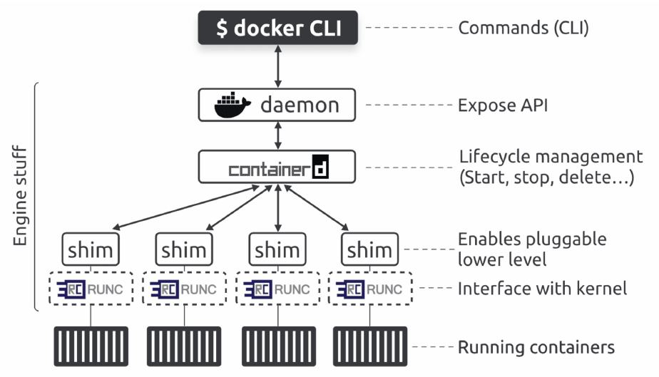
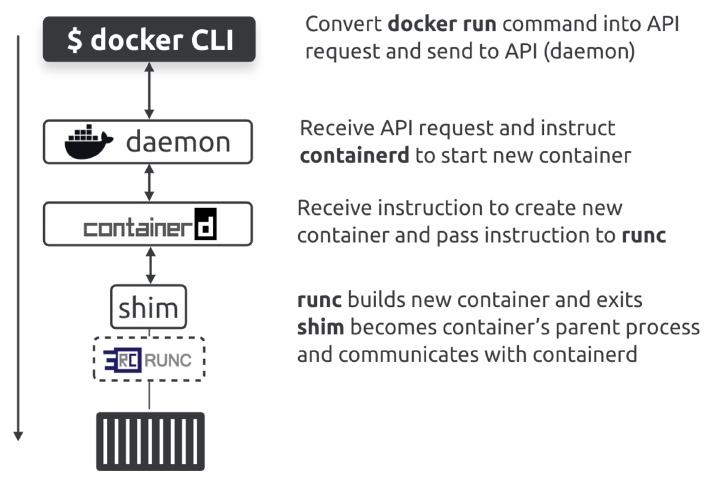

# 05. The Docker Engine

Docker Engine is a jargon for the server-side components of Docker that run and manage containers.
The Docker Engine is modular and built from many small specialized components pulled from projects such as the OCI, the CNCF, and the Moby project.
The Docker engine is made from many specialized tools that work together to create and run containers - the API, image builder, high-level runtime, low-level runtime, etc

## The Docker Engine

* When Docker was first released, the Docker Engine had two major components
    * The Docker Daemon: a monolithic binary containing all the code for the API, image builders, container execution, volumes, networking, and more.
    * LXC: it interacted with the Linux kernel and constructed the required namespaces and cgroups to build and start containers

* Relying on LXC posed several problems for the Docker projects
    * LXC is Linux-specific, and docker had aspirations of being multi-platform
    * Docker was evolving fast, and there was no way of ensuring LXC evolved in the ways Docker needed
    * To improve the experience and help the project evolved more quickly, Docker replaced LXC with its own tool, `libontainer`, whose goal was to be a platform-agnostic tool that gave Docker access to the fundamental container building block in the host kernel

* The Docker engine was a monolithic, with almost all funcionality coded into the daemon. However, as time passed, this became more and more problematic.
* The project began a long-running program to break apart and refactor the Engine so that every feature became its own small specialized tool

## The influence of the Open Container Initiative (OCI)

* Around the same time that Docker Inc. was refactoring the Engine, the OCI was in the process of defining two container-related standards:
    * Image Specification (image-spec)
    * Runtime Specification (runtime-spec)

## runc

* `runc` is the reference implementation of the OCI runtime-spec
* Is a lightweight CLI wrapper for libcontainter that anyone can download and use to manage OCI-compliant containers. However it's a very low-level tool and lacks almost all of the features and add-ons that can be got with the Docker engine
* Docker and Kubernetes both use `runc` as their default low-level runtime, and both pair it with the containerd high-level runtime
    * containerd operates as the high-level runtime managing lifecycle events
    * runc operates as the low-level runtime executing lifecycle events by interfacing with the kernel to do the work of actually building containers and deleting them

## containerd

* `containerd` is refered as a high-level runtime as it manages lifecycle events such as starting, stopping, and deleting containers. However, it needs a low-level runtime to perform the actual work. Most of the time containerd is paired with runc as its low-level runtime
* The original plan was for containerd to be a small specialized tool for managing container lifecycle events. However it has since grown to include the ability to manage images, networks, and volumes

## Starting a new container (example)

* `docker run -d --name name-container name-image`: start a new container called `name-container` based on the `name-image` image
* `docker ps`: to see containers running

* When we run commands like this, the Docker client converts them into API requests and send them to the API exposed by the daemon. The daemon receives the request, interprets it as a request to create a new container, and passed it to containerd. the daemon communicates with containerd via a CRUD-style API. containerd converts the requiered Docker image into an OCI bundle and tells runc to use this to create a new container. runc interfaces with the OS kernel to pull together all the constructs necessary to create a container (namespaces, cgroups, etc). The container starts as a child process of runc, and as soon as the container start, runc exits

## Shim

* Shim are a popular software engineering pattern, and the Docker Engine uses them in between containerd and the OCI layer, bringing the following benefits:
    * daemonless containers
    * improved efficienty
    * pluggable OCI layer
* containerd forks a shim and a runc process for every new container. However, each runc process exists as soon as the container starts running, leaving the shim process as the container's parent process. The shim is lightweight and sits between containerd and the container

## How it's implemented on Linux

* On a linux system, Docker implements the components we've discuesed as the following separate binaries:
    * /usr/bin/dockerd
    * /user/bin/containerd
    * /user/bin/containerd-shim-runc-v2
    * /user/bin/runc

* Docker has stripped most of the functionality out of the daemon. However, it still serves the Docker API
