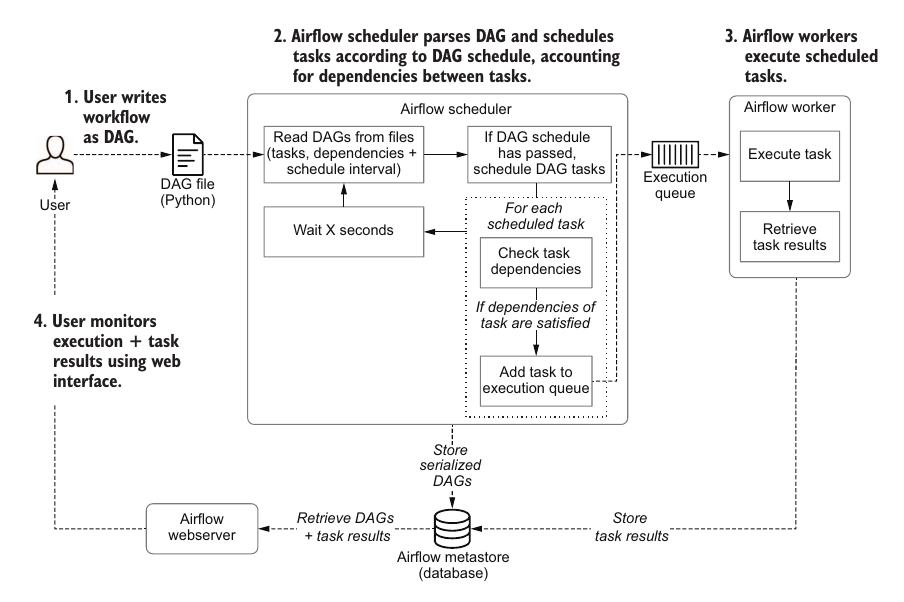

# 01. Meet Apache Airflow

* Apache Airflow is a batch-oriented framework for building data pipelines
* Apache Airflow enables to esasily build scheduled data pipelines, using a flexible Python framework, while also providing the abilitie to stitch together many different techonologies
* Airflow is not a data processing tool in itself but orchestrates the different component responsibles for processing data in data pipelines

## 1.1. Data pipelines

* Tasks or actions that need to be executed to achieve a desired result

### Data Pipelines as graphs
* Tasks dependencies can be drawn as graph
* In a graph-based representation, tasks are represented as nodes in the graph, while dependencies between tasks  are represented by directed edges between the task nodes
* Data pipelines can be represented as DAGs (directed acyclic grapth), which clearly define tasks and their dependencies. These graphs can be executed efficiently, taking advantage of any parallelism inherent in the dependency structure.

### Executing a pipeline graph
1. For each open (=uncompleted) task in the graph:
    - For each edge pointing toward the task, check if the "upstream" task on the other end of the edge has been completed
    - If all upstream tasks have been completed, add the task under consideration to a queue of tasks to be executed
2. Execute the tasks in the execution queue, marking them completed once they finish performing their work
3. Jump back to step 1 and repeat until all tasks in the graph have been completed

### Pipeline graphs vs sequential scripts
* Two separate and independent branchs can be executed in parallel, making better use of available resources and potentially decreasing the running time of a pipeline compared to executing the tasks sequentially
* The graph-based representation separates pipelines into small incremental tasks rather than having one monolithic script of process

### Running pipeline using workflow managers
*  Although many workflow managers have been developed over the years for executing graphs of tasks, Airflow has several key features that makes it uniquely suited for implementing efficient, batch-oriented data pipelines.

## 1.2. Introducing Airflow

### Defining pipelines flexibly in code
* Airflow allows to define pipelines or workflows as DAGs of tasks.
* In Airlfow, DAGs are defined using Python code in DAG files, each DAG file typically describes the set of tasks for a given DAG and the dependencies between the tasks

### Scheduling and executing pipelines
* The DAGs defines a schedule interval that determines when the DAG is executed by Airflow
* Process of developing and running Airlfow DAGs:
    - The Airflow scheduler - Parses DAGs, checks their schedule interval, and (if the DAGs’ schedule has passed) starts scheduling the DAGs’ tasks for execution by passing them to the Airflow workers
    - The Airflow workers - Pick up tasks that are scheduled for execution and execute them. As such, the workers are responsible for actually “doing the work”
    - The Airflow webserver - Visualizes the DAGs parsed by the scheduler and provides the main interface for users to monitor DAG runs and their results
* The Scheduler runs through the following steps:
    - Once users have written their workflows as DAGs, the files containing these DAGs are read by the scheduler to extract the corresponding tasks, dependencies, and schedule interval of each DAG
    - For each DAG, the scheduler then checks whether the schedule interval for the DAG has passed since the last time it was read. If so, the tasks in the DAG are scheduled for execution
    - For each scheduled task, the scheduler then checks whether the dependencies (= upstream tasks) of the task have been completed. If so, the task is added to the execution queue
    - The scheduler waits for several moments before starting a new loop by jumping back to step 1

### Monitoring and handling failures
* Airflow provides an extensive web interface that can be used for viewing DAGs and monitoring the results of DAG runs
* By default, Airflow can handle failures in tasks by retrying them a couple of times (optionally with some wait time in between), which can help tasks recover from any intermittent failures. If retries don’t help, Airflow will record the task as being failed

### Incremental loading and backfilling
*  the schedule intervals not only trigger DAGs at specific time points (similar to Cron), but also provide details about the last and (expected) next schedule intervals.
*  Airflow allows to easily create (or backfill) new data sets with historical data simply by running a DAG for these past schedule intervals
