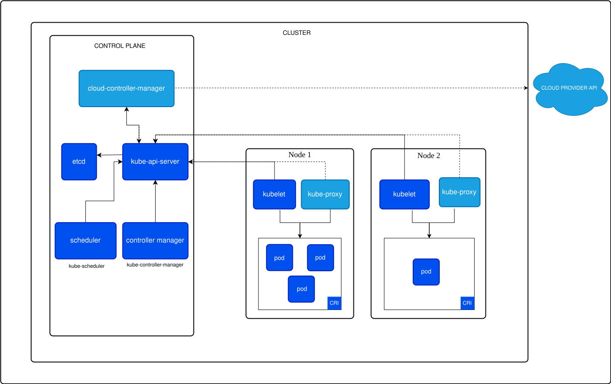

# Cluster Architecture

* A Kubernetes cluster consists of a control plane plus a set of worker machines, called nodes, that run containerized applications. Every cluster needs at least one worker node in order to run Pods
* The worker node(s) host the Pods that are the components of the application workload. The control plane manages the worker nodes and the pods in the cluster

## Control Plane Components

* The control plane's components make global decisions about the cluster, as well as detecting and responding to cluster events
* Control plane components can be run on any machine in the cluster. However, for simplicity, setup scripits typically start all control plane components, and do not run user containers on this machine

### kube-apiserver

* It exposes the Kubernetes API
* Is the only component that talks to `etcd` directly

### etcd

* Consistent and highly-available key value store used as Kubernetes' backing store for all cluster data
* Is the only place where the cluster's state is stored. Every other component in the control plane in stateless
* If `etcd` goes down and we don't have a backup, the cluster's configuration is lost

### kube-scheduler

* Watches for newly created Pods with no assigned node, and selects a node for them to run on
* Factors taken in account for scheduling decisions include: individual and collective resource requirements, hardware/software/policy constraints, data locality, and deadlines

### kube-controller-manager

* Runs controller processes
* Logically, each controller is a separate process, but to reduce complexity, they are all compiled into a single binary and run in a single process
* There are many different types of controllers
    * Node controller: responsible for noticing and responding when nodes go down
    * Job controller: watches for job objects that represent one-off tasks, then creates Pods to run those tasks to completion
    * EndpointSlice: populates EndpointSlice objects (to provide a link between Services and Pods)
    * ServiceAccount controller: create default ServiceAccounts for new namespaces

### cloud-controller-manager

* Embeds cloud-specific control logic
* It lets us link our cluster into a cloud provider's API, and separates out the components that interact with that cloud platform from components that only interact with our cluster
* Combines several logically independent control loops into a single binary that we run as a single process

## Node components

* Node components run on every node, maintaining running pods and providing the Kubernetes runtime environment

### kubelet

* It makes sure that containers are running in a Pod
* It takes a set of PodsSpecs that are provided through varios mechanisms and ensures that the containers described in those PodSpecs are running and healthy

### kube-proxy

* It maintains network rules on nodes. These network rules allow network communication to our Pods from network sessions inside or outside of our cluster
* It uses the operating system packet filtering layer if there is one and it's available. Otherwise, kube-proxy forwards the traffic itself

### Container runtime

* It empowers Kubernetes to run containers effectively. It is responsible for managing the execution and lifecycle of containers within the Kubernetes environment